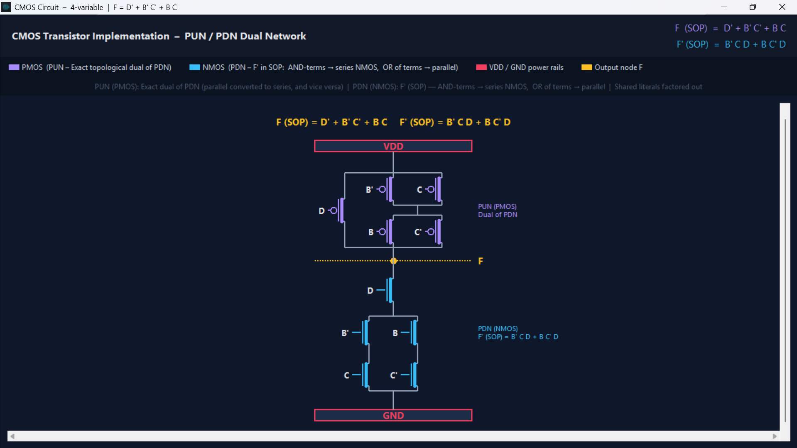

# Advanced Logic Minimizer & EDA Tool

A high-performance Electronic Design Automation (EDA) tool built in Python. It simplifies Boolean expressions using the **Quine–McCluskey algorithm** (tabular method) and provides deep insights into digital logic design through interactive K-Maps, Boolean algebra derivations, CMOS schematics, and universal gate synthesis.

## Key Features

- **Interactive Karnaugh Maps (K-Maps)**: Supports 2–4 variables with two-way real-time synchronization between the Truth Table and the K-Map interface.
- **Advanced Logic Minimization**: 
  - Handles Don’t Care (`X`) conditions for optimal simplification.
  - Generates minimized **Sum of Products (SOP)** and **Product of Sums (POS)** for both the function **F** and its complement **F'**.
  - Provides factored forms of the logic expressions.
- **Step-by-Step Algebra Derivations**: View detailed algebraic derivations converting prime implicants into minimized SOP, and applying De Morgan's laws for POS conversion.
- **CMOS Circuit Schematic Generator**: Automatically synthesizes the Pull-Up Network (PUN) using PMOS and Pull-Down Network (PDN) using NMOS based on the minimized expressions.
- **Universal Gates Synthesizer**: Converts the minimized boolean logic into NAND-only and NOR-only gate implementations.
- **Modern Dark UI**: Features a sleek, responsive, and native-feeling dark mode interface utilizing the Sun Valley (`sv_ttk`) theme.

## Screenshots 

- **Main UI (Truth Table + K-Map)**: `UI.png`
- **Results (SOP/POS for F and F′)**: `Results.png`
- **Boolean Algebra Derivations**: `SimplificationSteps.png`

- **Implementation Using Universal Gates**" `Universal Gates.png`


## Project Structure

- `main_ui.py`: The core application orchestrator handling the Tkinter UI, K-Map integration, and overall state.
- `qm_algorithm.py`: Engine for the Quine–McCluskey solver, SOP/POS generation, and algebraic step derivation.
- `kmap_visuals.py`: Interactive canvas-based K-Map rendering layer.
- `cmos_schematic.py`: Logic to build and visualize CMOS Pull-Up and Pull-Down networks dynamically.
- `universal_gates.py`: Synthesizes logic into NAND and NOR universal gate equivalents.

## How to Run

### Prerequisites

- **Python 3.10+** (Tkinter included with standard Python installations)
- Install the UI theme dependency:
  ```bash
  pip install sv_ttk
  ```

### Execution

Run the main application file from your terminal or command prompt:

```bash
python main_ui.py
```
